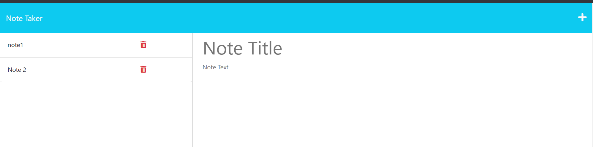
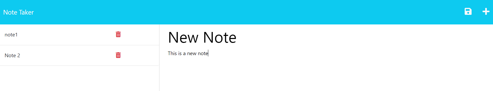

# NoteTaker


## Description 

Create and store notes. This app allows the user to create simple notes and store them for latter reading. THe app also allows the user to delete any notes that are no longer needed.




## Table of Contents
* [installation](#installation)
* [Usage](#usage)
* [License](#license)


## Installation
To install necessary dependencies, run the following command:
```
npm i
```
## Usage

You can find the deployed application [here](https://murmuring-mesa-24022.herokuapp.com/)

or

First clone the repo and from the command line CD into the directory. Once in the directory follow the [install instructions](#installation) and then run either one of the following commands

Use your own Port:
```
PORT=<your port number> node server.js
``` 
Use test port of 3001
```
node server.js
``` 

## License
This project is licensed under the MIT.
